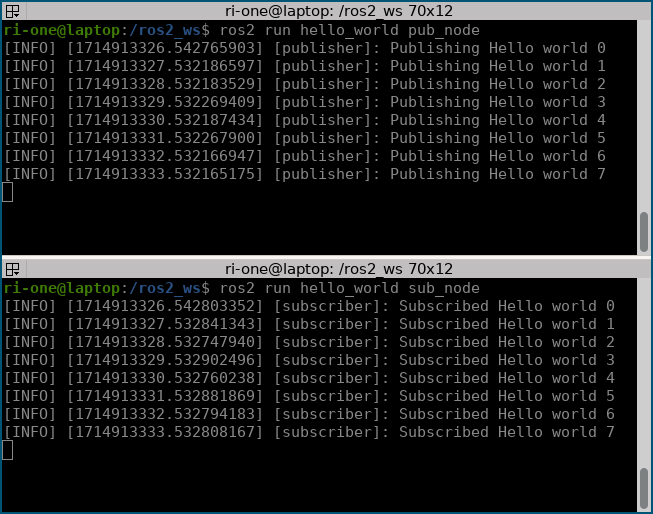

# Hello world

今回は簡単なパブリッシャ、サブスクライバを作ってHello worldが出来るパッケージを作ります。

## 初めてのワークスペース

ワークスペースとはパッケージのソースコードを編集したり、実行したりするフォルダです。
ROS 2ではパッケージという単位でソースコードを管理します。

ここでは`my_ws`というワークスペースで作業します。
ホームディレクトリに新しくワークスペースフォルダを作りましょう。

```none
mkdir ~/my_ws
cd ~/my_ws
```

`my_ws`の`src`ディレクトリに`hello_world`パッケージを作成します。

```none
mkdir -p ~/my_ws/src
cd ~/my_ws/src
ros2 pkg create --build-type ament_python hello_world
```

`--build-type`オプションで作成するパッケージの種類をしています。
ここでは`ament_cmake`や`ament_python`などを指定できます。

`tree`コマンドでパッケージの構成を確認してみると以下のようになっています。

```
$ tree
.
├── hello_world
│   └── __init__.py
├── package.xml
├── resource
│   └── hello_world
├── setup.cfg
├── setup.py
└── test
    ├── test_copyright.py
    ├── test_flake8.py
    └── test_pep257.py

3 directories, 8 files
```

この`hello_world`パッケージは`ament_python`形式なので上のようになっています。

```{note}
`hello_world/__init__.py`や`resouce/hello_world`ファイルは空ファイルですが、パッケージに必要なので消さないでください。
```

## コードの編集

今回はコピペで構わないので以下のPythonのコードを`hello_world/pub_node.py`に書いてください。

```py
import rclpy
from rclpy.node import Node
from std_msgs.msg import String

class Publisher(Node):
    def __init__(self):
        super().__init__("publisher")
        self.text_pub = self.create_publisher(String, "text", 10)
        self.timer = self.create_timer(1, self.timer_callback)
        self.i = 0

    def timer_callback(self):
        msg = String()
        msg.data = "Hello world {}".format(self.i)
        self.text_pub.publish(msg)
        self.get_logger().info("Publishing {}".format(msg.data))
        self.i += 1

def main(args=None):
    rclpy.init(args=args)

    node = Publisher()
    rclpy.spin(node)

    node.destroy_node()
    rclpy.shutdown()

if __name__ == "__main__":
    main()
```

同じように以下のコードを`hello_world/sub_node.py`に書いてください。

```py
import rclpy
from rclpy.node import Node
from std_msgs.msg import String

class Subscriber(Node):
    def __init__(self):
        super().__init__("subscriber")
        self.text_sub = self.create_subscription(String, "text", self.text_callback, 10)

    def text_callback(self, msg):
        self.get_logger().info("Subscribed {}".format(msg.data))

def main(args=None):
    rclpy.init(args=args)

    node = Subscriber()
    rclpy.spin(node)

    node.destroy_node()
    rclpy.shutdown()

if __name__ == "__main__":
    main()
```

### package.xmlに依存関係を追加

`package.xml`内に以下の2行を追加してください。

```xml
<exec_depend>rclpy</exec_depend>
<exec_depend>std_msgs</exec_depend>
```

追加すると以下のような`package.xml`ファイルになっていると思います。

```xml
<?xml version="1.0"?>
<?xml-model href="http://download.ros.org/schema/package_format3.xsd" schematypens="http://www.w3.org/2001/XMLSchema"?>
<package format="3">
  <name>hello_world</name>
  <version>0.0.0</version>
  <description>TODO: Package description</description>
  <maintainer email="shuto.tamaoka@gmail.com">ri-one</maintainer>
  <license>TODO: License declaration</license>

  <test_depend>ament_copyright</test_depend>
  <test_depend>ament_flake8</test_depend>
  <test_depend>ament_pep257</test_depend>
  <test_depend>python3-pytest</test_depend>

  <export>
    <build_type>ament_python</build_type>
  </export>

  <!-- この2行を追加 -->
  <exec_depend>rclpy</exec_depend>
  <exec_depend>std_msgs</exec_depend>
</package>
```

### setup.pyにエントリーポイントを追加

`setup.py`の`entry_points`の部分を以下のように編集してください。

```py
    entry_points={
        'console_scripts': [
            'pub_node = hello_world.pub_node:main',
            'sub_node = hello_world.sub_node:main',
        ],
    },
```

`console_scripts`の中の配列は`実行名 = パッケージ名.ファイル名:関数`の形式になっています。

## ビルドと実行

`~/my_ws`で`colcon build`コマンドでビルドしてください。

```none
cd ~/my_ws
colcon build
```

```{note}
必ず、ワークスペースのルートディレクトリで`colcon build`コマンドを実行してください。
```

次にセットアップファイルを`source`もしくは`.`コマンドで読み込んでください。

```none
source install/setup.bash
```

セットアップファイルを読み込んだら、2つ端末を用意して`ros2 run`コマンドでパブリッシャとサブスクライバを実行してみましょう。

```none
ros2 run hello_world pub_node
ros2 run hello_world sub_node
```

```{note}
必ず、セットアップファイルを読み込んでから`ros2 run`コマンドで実行するようにしましょう。
```

すると`Hello world`の文字列ともに数字が両方の端末とも出力されていることが分かります。



## rqt_graphで通信の確認

rqt_graphという可視化ツールを使ってトピック通信の様子を見てみましょう。
もう1つ端末を開いて`rqt_graph`コマンドを実行しましょう。

```none
rqt_graph
```

すると以下のように通信の様子がグラフで表されます。


今回の場合、`/publisher`ノードから`/text`トピックを介して`/subscriber`ノードに通信が行われていることが分かります。

## 参照

- [https://docs.ros.org/en/humble/Tutorials/Beginner-Client-Libraries/Writing-A-Simple-Py-Publisher-And-Subscriber.html](https://docs.ros.org/en/humble/Tutorials/Beginner-Client-Libraries/Writing-A-Simple-Py-Publisher-And-Subscriber.html)
